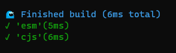

# Waterlogged

This is a super simple "library"(a whole single function) for running multiple formats for esbuild in parallel with some pretty logging inspired by Remix' compiler



## Install
`npm i -D @kruining/waterlogged`

**Note** Make sure you have esbuild installed. It is a peer dependency of this lib, 
this is so that you are free to choose the version of esbuild you want to run.

## Usage
`esbuild.mjs`
```ts
import { compile } from './dist/index.mjs';

await compile([ 'esm', 'cjs' ], {
    entryPoints: [ './src/index.ts' ],
    outbase: 'src',
    outfile: 'lib/index.$formatExtension',
    bundle: false,
    sourcemap: true,
    minify: true,
    platform: 'node',
    target: [ 'esnext' ],
    watch: process.argv[2] === 'watch',
});
```

`package.json`
```json
{
    ...,
    "scripts": {
        "build:typed": "node ./esbuild.mjs && tsc",
        "build": "node ./esbuild.mjs",
        "dev": "node ./esbuild.mjs watch",
        ...,
    },
    ...
}
```

**Note**: How you define and set up your watch mode is completely up to you, I simply added it to the docs as an example. 
This library just parallelizes your esbuilds based on the formats given and logs in a fancy format.

## Arguments

| param   | type                           | description                                                           |
|---------|--------------------------------|-----------------------------------------------------------------------|
| formats | `Format[]`                     | an array of formats for esbuild's `format` option, with the same type |
| options | `Omit<BuildOptions, 'format'>` | just esbuild's options object, minus the format option                |

## "Variables"
I have added simple string replacement logic for the `outfile` and `outdir` options. 
`$format` is replaced with the current format.
And `$formatExtionsion` is replaced as per this table:

| format | extension |
|--------|-----------|
| `esm`  | `mjs`     |
| `cjs`  | `cjs`     |
| `iife` | `js`      |


[example_img]:
data:image/png;base64,iVBORw0KGgoAAAANSUhEUgAAASYAAABZCAYAAACTx4l6AAAMOElEQVR4Xu2cT4hlRxXGR5MxIXT3ZGZwESStMRijaDBBJAiiBhQ0LhQXMhJEZ2EwIGJE0BGVFlHyBx0GRnFEBxeGcRbjnyQEZ5OF0ZjgRnAlGIioIEGjJkrUQOl3+32vT59Xdavqvvte1+t8ix/v9a26p079Od+tqr6vDqytrQUhhGiJA/6CEELsNRImIURzSJiEEM0hYRJCNIeESQjRHBImIURzSJiEEM0hYRJCNIeESQjRHBImIURzSJiEEM0hYRJCNIeESQjRHBImIURzSJiEEM0hYRJCNMfKC9P1H747XPOuj81cr2UsO/uV1toHvtz42R+Fm754MVz91mMz6WI41x3b6tr1hk+dC1fd9M6Z9GUwSJiueNUbwsE7TodLvnB/uPQzPwgHP3JXd83nWzQYkG/+xu/CzSd/M5NWw7x20InAXx8D+PXaj56eud7H2P6k2gfigOukxs/a/BYEDu5HHWFjr4KnFPg3hqjPa6e0v5APaW+651ddn++F8FcL00uOfT4cOPuHcOC+v+ziNRd+H0789Bcz+WvBYLONZ4l1Cp6aeJr767XMY2dsIbD0DaAUi/An1j5HX3lD1ycc8DV+1uYnCE7ci6e5T/P5Xvfx74Y3fvlnXX746vMsC9QTPvjrtcxrp7a/kB/tB3FadvtVCdPl7/jQLjF6zy+fDd986r/hxBPPhdN//k/4yhPPhJOP/zq8/NXXh1s+MExlEVBQajSap9Un4yKEgJQMIM8i/UlR62dtfgJBygkNZ1SghVnVvIIyth1Q2v4UMbSpT1skVcL0om/9dipKhx54Jnz76efDA/+a5Us/fjDcdfHhmftLKAkqdpAdfD4P7eCpyXz4XmsHAYB8EEub13ZUSVksD08fpMOe72wED+wgHfkYYCUDyOL9gS0EtA1mX18OQDsrLWkfay/l51j1AniC9/nBemCGFxMvprNtkI/fbZ+V9HsO334WX3c/Nq5936er7dilGmz4Prf4e/vg+PHXF0mxMNnZ0hU//Hu47rHnwwcvPBJO/vzx8Ln7znefd575Tvj+k3/qPv39pZQIE9fa7IhYflxD5+ATHcDAsAOrxA4HBQYwvhP7BGZZ6DzY4lPdlkU7+EQe/m0HIOwwcHEdZdYMIO8P7kdZWILBjh1cvr4xYSppH2sv5edY9QK5+2CbSw/6bvvKChf7gJu9+M58Jf2eg+3H8UB/vE9+z4xiyL4otYPv9JNtnOqzXDtaSmJybIqFCZvdFKajDz3bCRPTMEPi0g3LuBvf9vbB4sSgsoOhrwFTjc9g4BMDn32d0WcHaaknjy3L27NlUbj8fRhA+I5BhXvsPg43nVM+p2Ab2mso2/ro6xsTJovP70n5OWa9QO4+pKNNubdE+ABgPWGD33Edf/M7KOn3UrxtD3y1/cU28+MlZ8fDB1KsDrl2tDQtTJd+8uxUmF568Z+7hMkDcbr9nq/NXC+BA8Lj8xGkxRot1ph9nZGygwFNH5CO+/1Ts6QsXx9rE+kpYfB2Soj54we1r2+q/FR+T8rPlN1U/hy5+5COQGcfISgR9Az8UmEq6fdSvG0P0rwIxZasOTvwD8tR9j/F2bc9y+xrR0tsPC2aQcJ0+MHtGdPRt7x7Jh/Bf++w/PPXc9Q2QipgYnb6OiNlB6DD8fThMgF5/RLM3+vL4uCz03DAf8WOGcAxf7iPYu3aPKnyU/k9KT9TdlP5c+T2O2J2bUCXChPI9XspMdsWpPk61QoTBBg+2tWGXfr5/LF2ShHzZdEMEqZLzv01vOKRf4drzj46kw8c/PpjXb7L3vuJmbQcsaDqIxUwMTt9nZGy4+GSkEswUFIW97u8PcLlzRhLHu8PB6312deX0/7YII7l98SCC4xZL4A6+GWqJeaHXcbWCJMl1u+l0HZqxlW7lIvZiT0AuHcV69OY/Ri5LZBFMUiYwMHzT4eXPfxcuPahP4arv3qu46p77w+XnX9qmmdRwoSBjcZmZ6Bj+XefHd/AJXYw0+ATCMAm8tpAKymLSwMMbHxHGfi0g4zvjMy7SQxfWBfYol1bFm2jfpz+c7AyX0n7EC4b2F72P1xj1Qv0BRvgLIHCw2CmP6xLTphK+r0UCrGdzVg7uc3vEjtM46wcNtnOtk9JX39Z2C7LfslysDCRyy/8Laz/5B/dp09blDBxkMTos4N0GwwldjjQCQeF9ydXFkBQckAABKvtcHynTwxkfHo7OWy9uPTxA9OWhU8ObOt3SftYewwoYAf6WPUiFDofuABPeM6QUJ7vr1JhKun3GlBn2z5+5gXb1ufUkrHPjrWBNor1KenrLxL7b+6ymFuY+hgiTELkgPhYoVv203y/wxlcSrCWQbEw4fdwL7730SqGbH4LUQoECUHkZ4NiPmLbDMumWJiEEGJZSJiEEM0hYRJCNIeESQjRHBImIURzSJgqOHTLejh8Yj0c2doIGzfPpi+DQ+/fLv/wnRth/fWz6ULsByRMhUAQjn5voxOFK4+v75koQBxR/pFTG+Homb0TSCEWyWBhuvK27UBd25xNy4HAwr0IMp+2F+T8gQghHbMUnwZwH9I9KXuj8P92P3L3tjgN6QMhWmawMCEoUoGaIycEyybnD+rZJ8IUJog1vpNU/rFguZjN+TQhVplBwoTlQxcQtw4LCM62UkLQCcWZbTHAkmUm8Da383TLGTtDmeSbCsUd25/YF+J3fM6Ul/EHInxkKy3CU4FI3F/sT6ZeMdBOQx8QQrTKIGFCMCF4/PVSGKix/RHOXvCJfNPZjBFBXusC/PgO3PehfaYzuCEu+O7L7PMH0B9/3d+PdqEv1lapP7l6xYAN4K8LscoMEiY8pfsCNQeCNhVMEDw/A0BeBKv9uwvoxFJpKhTHt8WNwc/A9/n7/AG05a8Tzrg4s+KMh2Ja6k+uXjG68np8F2IVqRYmBBuCp+8pPg+wHcMGH33gdT+rKBWCUmjLXycoe1d7YGP61LZA4e9Sf3L1ioF8tm2E2A8UCZOdxfA9Hp9nLBCUKAsBbPHLLAQsZirwh/tRtTOUUobs49iyavzpq1eM3P6XEKtIkTBN95Q2J5vePZux89LNNGoDbeIXl3s1QlBCJ8Y9e2pdWW5TvftPHv6VvzaHP65eM0zS+2ZzQqwiRcI0fY9n8hT36WPC5QzKwvduxnTr7iWN3WQGELIuQG9bjDDx5UrY8mmgKx/7bpPXBVgOxarUn1y9PLzfzyaFWHWKhAl0L/NBMCqXNEOAELG8DveGM98rIpjN2FlDqRDUwJcZo+K0uTNDor9D/MnVy8IN92X0hxDLpliYXvBgQ3srLpTLhLO3Tugi72QJsR+QMFUCQYI45P5btihiS1sh9hsSJiFEc0iYhBDNIWESQjSHhEkI0RwSJiFEc6y+ME2OClnGf6nwHzEdrSvE4ll5YeJLismfbYyEjtYVYnkMFqZWjtblkSXz2Mr5M/1JTuYt6+4HuPhd4eSt9SFtUwxe+NTRumKfMliYdLTubuwb2cuaVfHnLYv8UbUQe8EgYVr00br+t3JYpvklC9PIzG/KKo6pzfmTO1qEAtEtJyPiNf2tnI7WFaKIQcK0yKN1eboAf8DaBfCZnUPXrA0SEya799TZmRCbxfT5A2L2LdNTFzZ3/LLlWOGazs50tK4QSQYJk//1fC19R9l2sxOIkJl5dIIRmYmQmHBMg77nPtLnD4jZ9+ndf+vsiQgQn8qD62p8tvf0+S7EKlItTMs4Wrf2V/Mx4RhyTG2KmH2fDlGa2sfG9KmdWV6pMA3xWcIk9iNFwrQXR+v6632khKP7L1nFMbUpcvs4sfKt6JQKE6j1Obf/JcQqUiRMSz1ad8C/wGPCMMPE9yHvO3Vi3LOnFhNTHa0rxHCKhGn6Hg83eSN5xmK6nME+ljlqtk8MY8FZe0xtH7mjdfk6AYWHgqOjdYUYRpEwgT09WheikBKmxKyh5pjaEmqO1vVllQpTjc86WlfsZ4qFqVWm7yD17MOMAja0tyaisYc/BdHRuuKFwEoKE4LT/vQDnz7PotDRukIsnpUUJs5c8NktdSo2yoUQ7bOSwiSE2N9ImIQQzSFhEkI0h4RJCNEcEiYhRHNImIQQzSFhEkI0h4RJCNEcEiYhRHNImIQQzSFhEkI0h4RJCNEcEiYhRHNImIQQzSFhEkI0h4RJCNEcEiYhRHNImIQQzSFhEkI0x/8AjaMDXSJ5ZaMAAAAASUVORK5CYII=